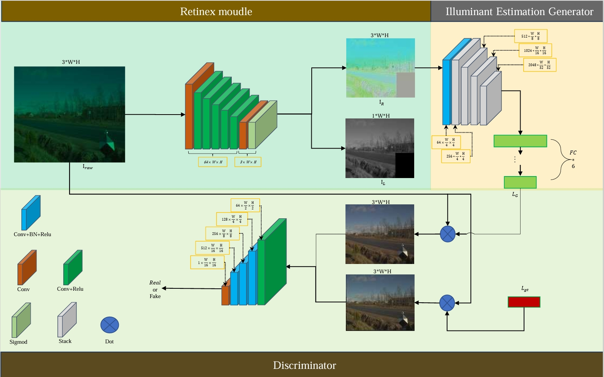
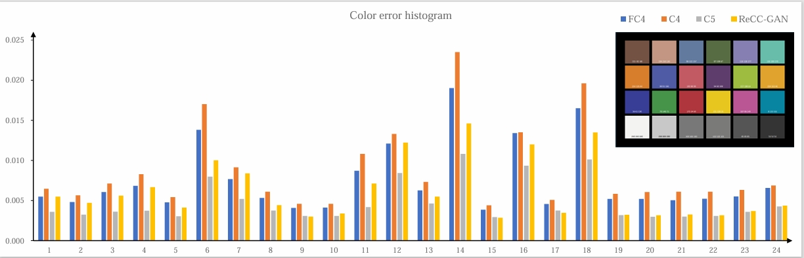

# ReCC-GAN
ReCC-GAN: Scene global illuminant estimation network based on Retinex and GAN

The datasets used in this article are [Cube++](https://github.com/Visillect/CubePlusPlus/) and [NUS-8](https://cvil.eecs.yorku.ca/projects/public_html/illuminant/illuminant.html), and the code will be open source after acceptance.

# File description

gan_gt.py is the model file

Gan_train_2.py is the training file

# Pretrained model

The pre-trained model will be uploaded in two weeks (Chinese New Year).

# Grateful

 Part of the code in this warehouse is written with reference to [wei](https://github.com/aasharma90/RetinexNet_PyTorch) and [FC4](https://github.com/matteo-rizzo/fc4-pytorch). We are very grateful for their open source help!

# Architecture

 <!-- 此路径表示图片和MD文件，处于同一目录 -->

# Result

 <!-- 此路径表示图片和MD文件，处于同一目录 -->
 <!-- 此路径表示图片和MD文件，处于同一目录 -->
