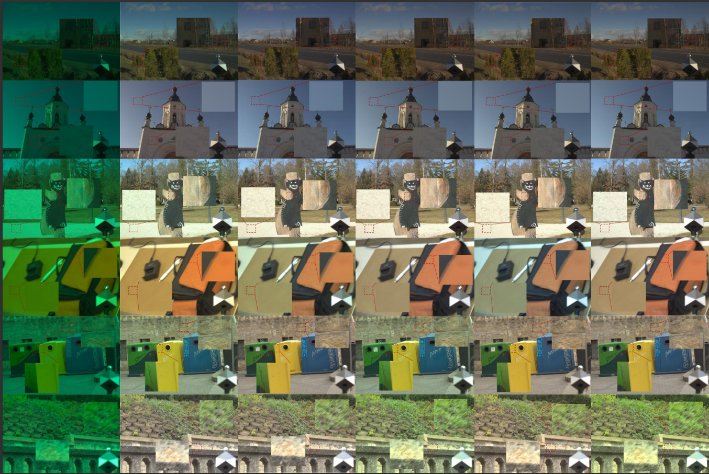

# ReCC-GAN
ReCC-GAN: Scene global illuminant estimation network based on Retinex and GAN

The datasets used in this article are [Cube++](https://github.com/Visillect/CubePlusPlus/) and [NUS-8](https://cvil.eecs.yorku.ca/projects/public_html/illuminant/illuminant.html), and the code will be open source after acceptance.
 
 <!-- 此路径表示图片和MD文件，处于同一目录 -->
